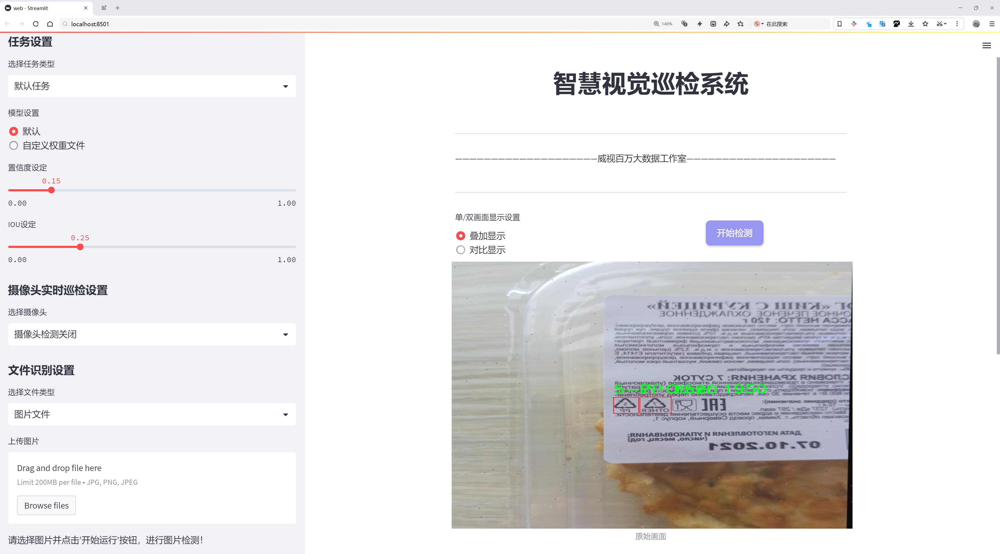
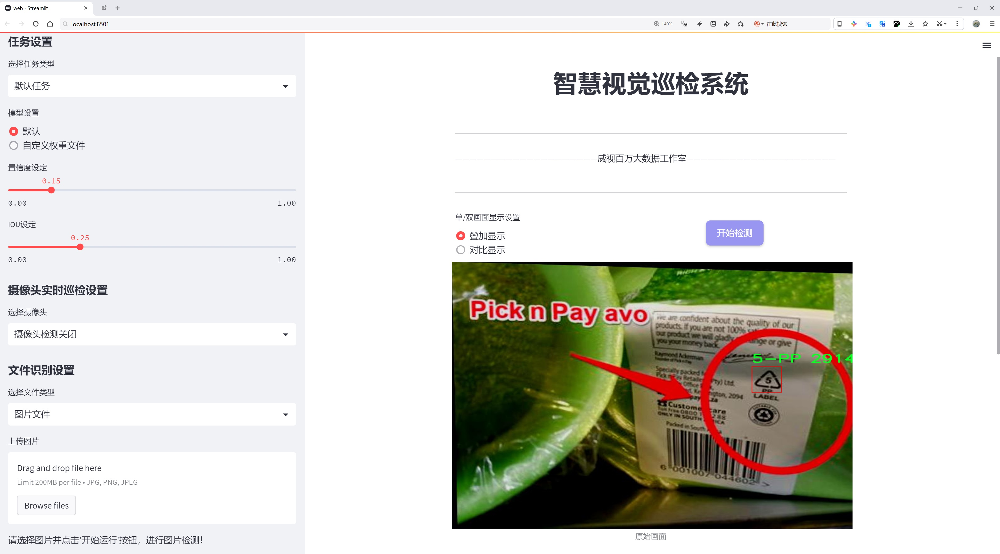
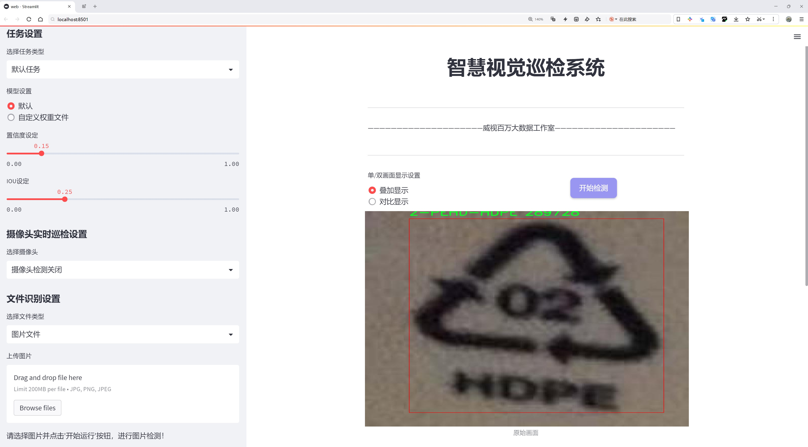
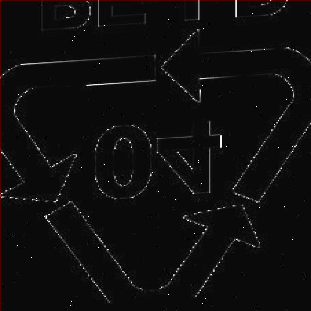
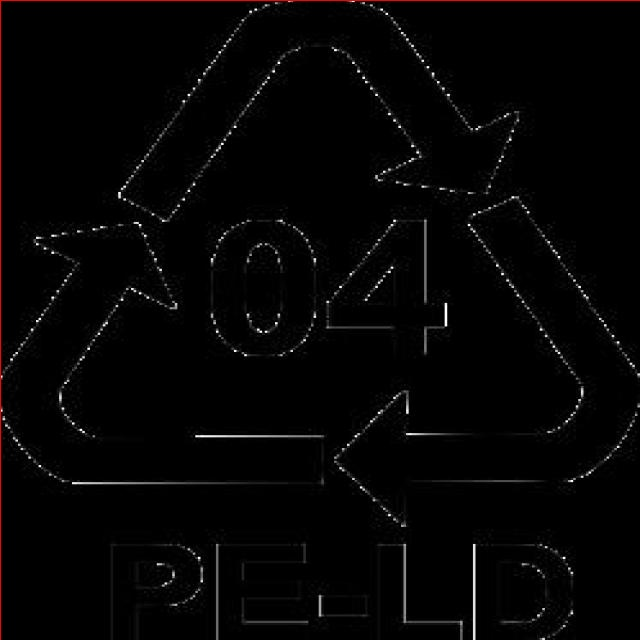
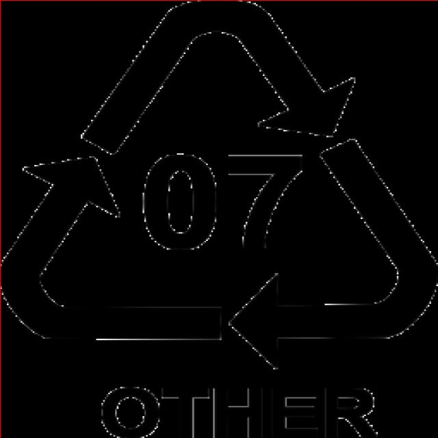
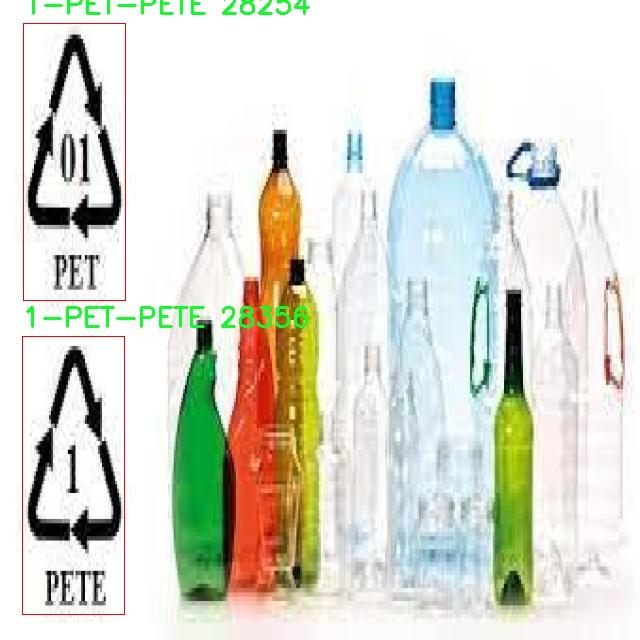
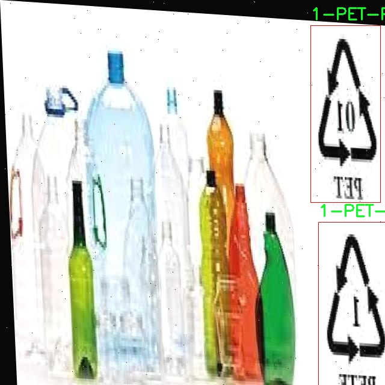

# 垃圾回收级别分类识别检测系统源码分享
 # [一条龙教学YOLOV8标注好的数据集一键训练_70+全套改进创新点发刊_Web前端展示]

### 1.研究背景与意义

项目参考[AAAI Association for the Advancement of Artificial Intelligence](https://gitee.com/qunmasj/projects)

项目来源[AACV Association for the Advancement of Computer Vision](https://kdocs.cn/l/cszuIiCKVNis)

研究背景与意义

随着城市化进程的加快和人口的不断增长，垃圾产生量逐年上升，垃圾分类与回收已成为全球范围内亟待解决的环境问题。垃圾的有效分类不仅有助于资源的回收利用，减少环境污染，还能提高公众的环保意识。因此，建立一个高效、准确的垃圾分类识别系统显得尤为重要。近年来，深度学习技术的迅猛发展为图像识别领域带来了新的机遇，尤其是目标检测算法的进步，使得垃圾分类的自动化和智能化成为可能。

YOLO（You Only Look Once）系列算法因其快速且准确的目标检测能力，已广泛应用于各种视觉识别任务中。YOLOv8作为该系列的最新版本，进一步提升了检测精度和速度，适用于实时应用场景。然而，现有的YOLOv8模型在特定领域的应用，尤其是垃圾分类识别方面，仍存在一定的局限性。为此，基于改进YOLOv8的垃圾回收级别分类识别系统的研究具有重要的理论和实践意义。

本研究所使用的数据集包含3508张图像，分为两个类别，涵盖了不同类型的垃圾图像。这一数据集为模型的训练和测试提供了丰富的样本，有助于提高分类的准确性和鲁棒性。通过对数据集的深入分析，可以发现不同类别垃圾的特征和分布，为模型的改进提供了重要依据。针对YOLOv8的特性，研究将重点在于优化网络结构、调整超参数以及增强数据集的多样性，以提升模型在垃圾分类任务中的表现。

此外，垃圾分类不仅仅是技术问题，更是社会问题。通过构建基于改进YOLOv8的垃圾回收级别分类识别系统，可以为城市垃圾管理提供科学依据，推动智能垃圾分类设备的研发与应用。该系统的成功实施，将有助于提升垃圾分类的效率，降低人工成本，促进资源的有效回收，进而实现可持续发展目标。

在理论层面，本研究将为目标检测算法在特定应用领域的改进提供新的思路和方法，丰富现有的深度学习研究。同时，研究成果也将为后续的垃圾分类技术研究提供参考，推动相关领域的学术进步。在实践层面，研究将为城市垃圾管理提供切实可行的解决方案，促进公众对垃圾分类的认知与参与，提升社会整体的环保意识。

综上所述，基于改进YOLOv8的垃圾回收级别分类识别系统的研究，不仅具有重要的学术价值，也将为实际垃圾分类工作提供有力支持，助力环境保护和可持续发展。通过本研究，期望能够为未来的垃圾分类技术创新提供新的方向，推动智能化垃圾管理的实现。

### 2.图片演示







##### 注意：由于此博客编辑较早，上面“2.图片演示”和“3.视频演示”展示的系统图片或者视频可能为老版本，新版本在老版本的基础上升级如下：（实际效果以升级的新版本为准）

  （1）适配了YOLOV8的“目标检测”模型和“实例分割”模型，通过加载相应的权重（.pt）文件即可自适应加载模型。

  （2）支持“图片识别”、“视频识别”、“摄像头实时识别”三种识别模式。

  （3）支持“图片识别”、“视频识别”、“摄像头实时识别”三种识别结果保存导出，解决手动导出（容易卡顿出现爆内存）存在的问题，识别完自动保存结果并导出到tempDir中。

  （4）支持Web前端系统中的标题、背景图等自定义修改，后面提供修改教程。

  另外本项目提供训练的数据集和训练教程,暂不提供权重文件（best.pt）,需要您按照教程进行训练后实现图片演示和Web前端界面演示的效果。

### 3.视频演示

[3.1 视频演示](https://www.bilibili.com/video/BV1psxgeoEib/)

### 4.数据集信息展示

##### 4.1 本项目数据集详细数据（类别数＆类别名）

nc: 7
names: ['1-PET-PETE', '2-PEHD-HDPE', '3-PV', '4-PELD-LDPE', '5-PP', '6-PS', '7-Other']


##### 4.2 本项目数据集信息介绍

数据集信息展示

在本研究中，我们采用了名为“Test”的数据集，以支持改进YOLOv8的垃圾回收级别分类识别系统的训练和评估。该数据集的设计旨在提高垃圾分类的准确性和效率，尤其是在日益增长的城市垃圾处理需求背景下。数据集包含七个主要类别，分别是：1-PET-PETE、2-PEHD-HDPE、3-PV、4-PELD-LDPE、5-PP、6-PS和7-Other。这些类别涵盖了现代生活中常见的塑料材料，能够为模型提供丰富的训练样本，以便更好地识别和分类不同类型的垃圾。

首先，数据集中的每个类别都对应着特定的塑料类型，反映了其在回收过程中的重要性。1-PET-PETE（聚对苯二甲酸乙二醇酯）是常见的饮料瓶材料，具有良好的回收价值；2-PEHD-HDPE（高密度聚乙烯）则广泛用于各种容器和包装材料，具有较高的耐用性和可回收性；3-PV（聚氯乙烯）在建筑和管道中常见，虽然其回收过程较为复杂，但仍然是重要的塑料类型；4-PELD-LDPE（低密度聚乙烯）通常用于购物袋和食品包装，回收难度相对较低；5-PP（聚丙烯）在食品容器和家居用品中应用广泛，具有良好的化学稳定性；6-PS（聚苯乙烯）常用于一次性餐具和包装材料，虽然回收率较低，但其影响不容忽视；最后，7-Other则涵盖了其他不易分类的塑料材料，提供了更大的灵活性以应对多样化的垃圾类型。

数据集的构建不仅考虑了类别的多样性，还注重样本的代表性和多样性。每个类别均包含大量的图像样本，确保模型在训练过程中能够接触到不同的拍摄角度、光照条件和背景环境。这种多样性使得模型能够更好地适应实际应用场景中的变化，提高其在真实世界中的表现。数据集中的图像经过精心标注，确保每个样本的准确性，为模型的训练提供了坚实的基础。

此外，数据集的使用还涉及到数据增强技术，以进一步提升模型的鲁棒性和泛化能力。通过对图像进行旋转、缩放、裁剪和颜色调整等处理，模型能够学习到更多的特征，从而在面对不同环境和条件时，依然能够保持较高的识别准确率。这一过程不仅提升了模型的性能，也为后续的垃圾分类应用提供了更为可靠的技术支持。

综上所述，数据集“Test”在本研究中发挥了至关重要的作用。通过对七个类别的细致划分和丰富样本的提供，数据集为改进YOLOv8的垃圾回收级别分类识别系统奠定了坚实的基础。未来，我们期待通过这一数据集的应用，能够显著提升垃圾分类的自动化水平，为环保事业贡献一份力量。











### 5.全套项目环境部署视频教程（零基础手把手教学）

[5.1 环境部署教程链接（零基础手把手教学）](https://www.ixigua.com/7404473917358506534?logTag=c807d0cbc21c0ef59de5)


[5.2 安装Python虚拟环境创建和依赖库安装视频教程链接（零基础手把手教学）](https://www.ixigua.com/7404474678003106304?logTag=1f1041108cd1f708b01a)

### 6.手把手YOLOV8训练视频教程（零基础小白有手就能学会）

[6.1 手把手YOLOV8训练视频教程（零基础小白有手就能学会）](https://www.ixigua.com/7404477157818401292?logTag=d31a2dfd1983c9668658)

### 7.70+种全套YOLOV8创新点代码加载调参视频教程（一键加载写好的改进模型的配置文件）

[7.1 70+种全套YOLOV8创新点代码加载调参视频教程（一键加载写好的改进模型的配置文件）](https://www.ixigua.com/7404478314661806627?logTag=29066f8288e3f4eea3a4)

### 8.70+种全套YOLOV8创新点原理讲解（非科班也可以轻松写刊发刊，V10版本正在科研待更新）

由于篇幅限制，每个创新点的具体原理讲解就不一一展开，具体见下列网址中的创新点对应子项目的技术原理博客网址【Blog】：


[8.1 70+种全套YOLOV8创新点原理讲解链接](https://gitee.com/qunmasj/good)

### 9.系统功能展示（检测对象为举例，实际内容以本项目数据集为准）

图9.1.系统支持检测结果表格显示

  图9.2.系统支持置信度和IOU阈值手动调节

  图9.3.系统支持自定义加载权重文件best.pt(需要你通过步骤5中训练获得)

  图9.4.系统支持摄像头实时识别

  图9.5.系统支持图片识别

  图9.6.系统支持视频识别

  图9.7.系统支持识别结果文件自动保存

  图9.8.系统支持Excel导出检测结果数据


### 10.原始YOLOV8算法原理

原始YOLOv8算法原理

YOLOv8作为YOLO系列的最新版本，继承并发展了前几代模型的优点，致力于在目标检测领域提供更高的精度和更快的推理速度。与以往的anchor-based检测方法相比，YOLOv8采用了anchor-free的策略，这一创新使得模型在处理复杂场景时，尤其是在小目标检测方面表现出色。YOLOv8的架构由多个模块组成，包括输入端、主干网络、Neck端和输出端，每个模块在整个检测流程中扮演着至关重要的角色。

在输入端，YOLOv8通过Mosaic数据增强、自适应图片缩放和灰度填充等预处理技术，提升了模型对不同场景和目标的适应能力。Mosaic增强方法通过将多张图像拼接在一起，生成新的训练样本，增加了数据的多样性，进而提高了模型的泛化能力。自适应图片缩放则确保输入图像符合模型要求的尺寸，避免了因尺寸不匹配而导致的特征损失。

主干网络是YOLOv8的核心部分，负责从输入图像中提取特征。该网络采用了多层卷积、池化等操作，利用C2f模块进一步增强特征提取能力。C2f模块借鉴了YOLOv7中的E-ELAN结构，通过跨层连接的方式，改善了梯度流动，从而提高了模型的学习效率和检测精度。SPPFl模块则通过多尺度最大池化操作，增强了网络对不同尺度特征的抽象能力，使得模型在面对多样化目标时能够更好地进行识别。

Neck端的设计基于PAN（Path Aggregation Network）结构，通过上采样和下采样的方式对不同尺度的特征图进行融合。这一过程不仅提高了特征的表达能力，还确保了模型在处理复杂场景时能够有效整合来自不同层次的信息，从而提升检测的准确性。通过对特征图的有效融合，YOLOv8能够在多种环境下保持较高的检测性能。

输出端采用了decoupled head结构，将分类和回归过程解耦。这一设计使得模型在进行目标检测时，可以分别优化分类和定位的损失，进而提高整体检测效果。YOLOv8使用Task-Aligned Assigner方法对分类分数和回归分数进行加权，以确保正样本的匹配更加精准。损失计算方面，YOLOv8结合了BCE（Binary Cross-Entropy）损失和DFL（Distribution Focal Loss）损失，进一步增强了模型在不同场景下的适应性和鲁棒性。

尽管YOLOv8在多个方面表现优异，但在复杂水面环境下，尤其是小目标漂浮物的检测中，仍然存在一些挑战。小目标的特征往往复杂且背景多样，导致模型在定位和感知能力上存在不足。为了解决这些问题，YOLOv8的改进版本YOLOv8-WSSOD应运而生。该改进版通过引入BiFormer双层路由注意力机制，构建C2fBF模块，旨在减轻主干网络下采样过程中的噪声影响，并保留更细粒度的上下文信息。这一创新使得模型在特征提取过程中能够更好地捕捉到小目标的细节，从而提高检测精度。

此外，YOLOv8-WSSOD还针对小目标漏检问题，添加了一个更小的检测头，以提升网络对小目标的感知能力。同时，在Neck端引入GSConv和Slim-neck技术，旨在保持模型的检测精度的同时，降低计算量。这一系列改进使得YOLOv8-WSSOD在处理复杂场景时，能够更有效地识别和定位小目标，提升了整体的检测性能。

最后，YOLOv8-WSSOD还使用MPDIoU损失函数替换了CIoU损失函数，以提高模型的泛化能力和精准度。MPDIoU损失函数通过引入多种距离度量，能够更全面地评估目标的定位精度，从而在复杂环境中提供更为可靠的检测结果。

综上所述，YOLOv8作为一款先进的目标检测模型，通过一系列创新设计和改进，极大地提升了目标检测的效率和准确性。尽管在特定环境下仍面临挑战，但通过不断的优化和改进，YOLOv8及其衍生版本有望在未来的应用中展现出更为卓越的性能。


### 11.项目核心源码讲解（再也不用担心看不懂代码逻辑）

#### 11.1 code\ultralytics\models\fastsam\model.py

以下是对代码的核心部分进行提炼和详细注释的结果：

```python
# Ultralytics YOLO 🚀, AGPL-3.0 license

from pathlib import Path  # 导入Path类，用于处理文件路径
from ultralytics.engine.model import Model  # 从ultralytics库中导入Model类
from .predict import FastSAMPredictor  # 导入FastSAMPredictor类，用于预测
from .val import FastSAMValidator  # 导入FastSAMValidator类，用于验证

class FastSAM(Model):
    """
    FastSAM模型接口。

    示例用法：
        ```python
        from ultralytics import FastSAM

        model = FastSAM('last.pt')  # 加载模型
        results = model.predict('ultralytics/assets/bus.jpg')  # 进行预测
        ```
    """

    def __init__(self, model="FastSAM-x.pt"):
        """初始化FastSAM类，调用父类Model的初始化方法。

        参数:
            model (str): 模型文件名，默认为"FastSAM-x.pt"。
        """
        # 如果传入的模型名称是"FastSAM.pt"，则更改为"FastSAM-x.pt"
        if str(model) == "FastSAM.pt":
            model = "FastSAM-x.pt"
        
        # 确保模型文件的后缀不是.yaml或.yml，FastSAM模型只支持预训练模型
        assert Path(model).suffix not in (".yaml", ".yml"), "FastSAM models only support pre-trained models."
        
        # 调用父类的初始化方法，设置模型和任务类型为"segment"
        super().__init__(model=model, task="segment")

    @property
    def task_map(self):
        """返回一个字典，将分割任务映射到相应的预测器和验证器类。
        
        返回:
            dict: 包含任务类型及其对应的预测器和验证器类的字典。
        """
        return {"segment": {"predictor": FastSAMPredictor, "validator": FastSAMValidator}}
```

### 代码分析：
1. **类定义**：`FastSAM`类继承自`Model`类，表示一个特定的模型接口。
2. **初始化方法**：在`__init__`方法中，检查模型文件名并确保其格式正确，最后调用父类的初始化方法。
3. **任务映射**：`task_map`属性返回一个字典，定义了如何将任务类型（如分割）映射到相应的预测器和验证器类。这使得模型可以根据任务类型灵活选择使用的组件。

该文件定义了一个名为 `FastSAM` 的类，它是 Ultralytics YOLO 框架中的一个模型接口，主要用于图像分割任务。文件首先导入了必要的模块，包括 `Path` 类用于路径操作，以及从 `ultralytics.engine.model` 导入的 `Model` 类，后者是该框架中所有模型的基类。此外，还导入了 `FastSAMPredictor` 和 `FastSAMValidator`，分别用于模型的预测和验证。

在 `FastSAM` 类的文档字符串中，提供了一个简单的使用示例，展示了如何加载模型并对一张图片进行预测。用户可以通过创建 `FastSAM` 类的实例并传入模型文件名来加载模型，然后调用 `predict` 方法进行图像分割。

构造函数 `__init__` 中，首先检查传入的模型名称，如果是默认的 "FastSAM.pt"，则将其替换为 "FastSAM-x.pt"。接着，使用 `assert` 语句确保传入的模型文件不是 YAML 格式的文件，因为 `FastSAM` 模型只支持预训练模型。最后，调用父类 `Model` 的构造函数，传入模型名称和任务类型（此处为 "segment"）。

类中还有一个名为 `task_map` 的属性，它返回一个字典，映射了分割任务到相应的预测器和验证器类。这使得 `FastSAM` 模型能够灵活地处理不同的任务，通过指定相应的预测器和验证器来实现。

总的来说，该文件实现了一个专门用于图像分割的模型接口，封装了模型的加载、预测和验证功能，为用户提供了简洁的使用方式。

#### 11.2 70+种YOLOv8算法改进源码大全和调试加载训练教程（非必要）\ultralytics\nn\backbone\revcol.py

以下是代码中最核心的部分，并附上详细的中文注释：

```python
import torch
import torch.nn as nn

class ReverseFunction(torch.autograd.Function):
    @staticmethod
    def forward(ctx, run_functions, alpha, *args):
        # 保存运行的函数和缩放因子
        ctx.run_functions = run_functions
        ctx.alpha = alpha
        ctx.preserve_rng_state = True

        # 获取输入参数
        [x, c0, c1, c2, c3] = args
        
        # 记录当前的随机数生成器状态
        with torch.no_grad():
            gpu_devices = get_gpu_device(*args)  # 获取当前使用的GPU设备
            ctx.gpu_devices = gpu_devices
            ctx.cpu_states_0, ctx.gpu_states_0 = get_cpu_and_gpu_states(gpu_devices)  # 获取CPU和GPU的随机状态
            
            # 逐层计算输出
            c0 = run_functions[0](x, c1) + c0 * alpha[0]
            ctx.cpu_states_1, ctx.gpu_states_1 = get_cpu_and_gpu_states(gpu_devices)
            c1 = run_functions[1](c0, c2) + c1 * alpha[1]
            ctx.cpu_states_2, ctx.gpu_states_2 = get_cpu_and_gpu_states(gpu_devices)
            c2 = run_functions[2](c1, c3) + c2 * alpha[2]
            ctx.cpu_states_3, ctx.gpu_states_3 = get_cpu_and_gpu_states(gpu_devices)
            c3 = run_functions[3](c2, None) + c3 * alpha[3]

        # 保存中间结果以供反向传播使用
        ctx.save_for_backward(x, c0, c1, c2, c3)
        return x, c0, c1, c2, c3

    @staticmethod
    def backward(ctx, *grad_outputs):
        # 反向传播过程
        x, c0, c1, c2, c3 = ctx.saved_tensors
        run_functions = ctx.run_functions
        alpha = ctx.alpha
        
        # 获取梯度
        gx_right, g0_right, g1_right, g2_right, g3_right = grad_outputs
        
        # 逐层反向传播
        with torch.enable_grad():
            # 反向计算每一层的梯度
            g3_up = g3_right
            g3_left = g3_up * alpha[3]  # shortcut
            set_device_states(ctx.cpu_states_3, ctx.gpu_devices, ctx.gpu_states_3)
            oup3 = run_functions[3](c2, None)
            torch.autograd.backward(oup3, g3_up, retain_graph=True)

            # 计算特征反向
            c3_left = (1 / alpha[3]) * (c3 - oup3)

            # 继续反向传播
            g2_up = g2_right + c2.grad
            g2_left = g2_up * alpha[2]  # shortcut
            (c3_left,) = detach_and_grad((c3_left,))
            set_device_states(ctx.cpu_states_2, ctx.gpu_devices, ctx.gpu_states_2)
            oup2 = run_functions[2](c1, c3_left)
            torch.autograd.backward(oup2, g2_up, retain_graph=True)

            # 继续反向传播
            c2_left = (1 / alpha[2]) * (c2 - oup2)
            g1_up = g1_right + c1.grad
            g1_left = g1_up * alpha[1]  # shortcut
            (c2_left,) = detach_and_grad((c2_left,))
            set_device_states(ctx.cpu_states_1, ctx.gpu_devices, ctx.gpu_states_1)
            oup1 = run_functions[1](c0, c2_left)
            torch.autograd.backward(oup1, g1_up, retain_graph=True)

            # 继续反向传播
            c1_left = (1 / alpha[1]) * (c1 - oup1)
            g0_up = g0_right + c0.grad
            g0_left = g0_up * alpha[0]  # shortcut
            (c1_left,) = detach_and_grad((c1_left,))
            set_device_states(ctx.cpu_states_0, ctx.gpu_devices, ctx.gpu_states_0)
            oup0 = run_functions[0](x, c1_left)
            torch.autograd.backward(oup0, g0_up, retain_graph=True)

            # 计算最终的梯度
            gx_up = x.grad

        return None, None, gx_up, g0_left, g1_left, g2_left, g3_left

class SubNet(nn.Module):
    def __init__(self, channels, layers, kernel, first_col, save_memory) -> None:
        super().__init__()
        self.save_memory = save_memory
        # 初始化缩放因子
        self.alpha0 = nn.Parameter(torch.ones((1, channels[0], 1, 1)), requires_grad=True)
        self.alpha1 = nn.Parameter(torch.ones((1, channels[1], 1, 1)), requires_grad=True)
        self.alpha2 = nn.Parameter(torch.ones((1, channels[2], 1, 1)), requires_grad=True)
        self.alpha3 = nn.Parameter(torch.ones((1, channels[3], 1, 1)), requires_grad=True)

        # 初始化每一层
        self.level0 = Level(0, channels, layers, kernel, first_col)
        self.level1 = Level(1, channels, layers, kernel, first_col)
        self.level2 = Level(2, channels, layers, kernel, first_col)
        self.level3 = Level(3, channels, layers, kernel, first_col)

    def forward(self, *args):
        # 根据是否保存内存选择前向传播方式
        if self.save_memory:
            return self._forward_reverse(*args)
        else:
            return self._forward_nonreverse(*args)

# 其他类和函数省略...
```

### 代码说明：
1. **ReverseFunction**：这是一个自定义的反向传播函数，使用了PyTorch的`torch.autograd.Function`。它实现了前向传播和反向传播的逻辑。
   - `forward`方法：计算前向传播的输出，并保存中间结果以供反向传播使用。
   - `backward`方法：实现反向传播，计算梯度并返回。

2. **SubNet**：这是一个子网络模块，包含多个层和缩放因子。
   - `__init__`方法：初始化缩放因子和网络层。
   - `forward`方法：根据内存保存策略选择前向传播方式。

以上是代码的核心部分，其他辅助类和函数可以根据需要进行补充。

这个程序文件是一个实现了YOLOv8算法中反向列（Reverse Column）结构的PyTorch模块，主要用于深度学习中的特征提取和处理。文件中包含了多个类和函数，以下是对其主要内容的讲解。

首先，文件导入了必要的PyTorch库以及一些自定义模块，包括卷积层和不同的块结构。接着，定义了一些辅助函数，如获取GPU状态、设置设备状态、分离张量并允许梯度计算等。这些函数的作用是管理和优化在多GPU环境下的随机数生成状态，以确保模型训练的稳定性和可重复性。

核心部分是`ReverseFunction`类，它是一个自定义的自动求导函数，包含了前向传播和反向传播的实现。在前向传播中，它接收多个函数和参数，通过调用这些函数来计算输出，并保存必要的状态以供反向传播使用。在反向传播中，它根据保存的状态和梯度信息，逐层计算梯度并更新参数。这个过程涉及到对特征的反向处理，以实现更高效的梯度计算。

接下来是`Fusion`、`Level`和`SubNet`类的定义。`Fusion`类负责融合不同层次的特征，`Level`类则定义了每一层的结构，包括融合和卷积操作。`SubNet`类包含多个层次的处理逻辑，并根据是否需要节省内存选择不同的前向传播方式。

最后，`RevCol`类是整个模块的入口，初始化时设置了网络的结构，包括卷积层和多个子网络。它的前向传播方法依次调用各个子网络，并返回不同层次的特征。

整体来看，这个文件实现了一个复杂的深度学习模型结构，旨在通过反向传播和特征融合的方式提高模型的性能和效率。通过灵活的设计，能够在多GPU环境下高效地进行训练和推理。

#### 11.3 ui.py

```python
import sys
import subprocess

def run_script(script_path):
    """
    使用当前 Python 环境运行指定的脚本。

    Args:
        script_path (str): 要运行的脚本路径

    Returns:
        None
    """
    # 获取当前 Python 解释器的路径
    python_path = sys.executable

    # 构建运行命令，使用 streamlit 运行指定的脚本
    command = f'"{python_path}" -m streamlit run "{script_path}"'

    # 执行命令
    result = subprocess.run(command, shell=True)
    # 检查命令执行结果，如果返回码不为0，则表示出错
    if result.returncode != 0:
        print("脚本运行出错。")

# 主程序入口
if __name__ == "__main__":
    # 指定要运行的脚本路径
    script_path = "web.py"  # 这里可以直接指定脚本路径

    # 调用函数运行脚本
    run_script(script_path)
```

### 代码核心部分及注释说明：

1. **导入模块**：
   - `sys`：用于访问与 Python 解释器相关的变量和函数。
   - `subprocess`：用于创建新进程、连接到它们的输入/输出/错误管道，并获得返回码。

2. **定义 `run_script` 函数**：
   - 该函数接受一个参数 `script_path`，表示要运行的 Python 脚本的路径。
   - 函数内部首先获取当前 Python 解释器的路径，以便在正确的环境中运行脚本。

3. **构建命令**：
   - 使用 f-string 构建命令字符串，调用 `streamlit` 模块来运行指定的脚本。

4. **执行命令**：
   - 使用 `subprocess.run` 执行构建的命令，并通过 `shell=True` 允许在 shell 中执行命令。
   - 检查命令的返回码，如果返回码不为0，表示脚本运行过程中出现了错误，打印错误信息。

5. **主程序入口**：
   - 在 `if __name__ == "__main__":` 块中，指定要运行的脚本路径，并调用 `run_script` 函数来执行该脚本。

这个程序文件名为 `ui.py`，主要功能是使用当前的 Python 环境来运行一个指定的脚本，具体是通过 Streamlit 框架来启动一个 Web 应用。

首先，程序导入了几个必要的模块，包括 `sys`、`os` 和 `subprocess`。其中，`sys` 模块用于访问与 Python 解释器相关的变量和函数，`os` 模块提供了与操作系统交互的功能，而 `subprocess` 模块则用于创建新进程、连接到它们的输入/输出/错误管道，并获取它们的返回码。

接下来，程序从 `QtFusion.path` 模块中导入了 `abs_path` 函数，这个函数的作用是获取给定路径的绝对路径。

在 `run_script` 函数中，程序接收一个参数 `script_path`，这是要运行的脚本的路径。函数首先获取当前 Python 解释器的路径，存储在 `python_path` 变量中。然后，构建一个命令字符串 `command`，这个命令会调用 Streamlit 来运行指定的脚本。命令的格式是 `"{python_path}" -m streamlit run "{script_path}"`，其中 `"{python_path}"` 和 `"{script_path}"` 会被实际的路径替换。

接着，程序使用 `subprocess.run` 方法来执行这个命令。这个方法会在新的 shell 中运行命令，并等待命令执行完成。执行完成后，程序检查返回码 `result.returncode`，如果返回码不为 0，表示脚本运行出错，程序会打印出错误信息。

最后，在 `if __name__ == "__main__":` 语句块中，程序指定了要运行的脚本路径，这里使用 `abs_path("web.py")` 来获取 `web.py` 的绝对路径。然后调用 `run_script` 函数来运行这个脚本。

总体来说，这个程序的核心功能是启动一个 Streamlit Web 应用，方便用户在当前 Python 环境中运行指定的脚本。

#### 11.4 train.py

以下是经过简化和注释的核心代码部分，主要保留了与YOLO目标检测训练相关的功能：

```python
import random
import numpy as np
import torch.nn as nn
from ultralytics.data import build_dataloader, build_yolo_dataset
from ultralytics.engine.trainer import BaseTrainer
from ultralytics.models import yolo
from ultralytics.nn.tasks import DetectionModel
from ultralytics.utils import LOGGER, RANK
from ultralytics.utils.torch_utils import de_parallel, torch_distributed_zero_first

class DetectionTrainer(BaseTrainer):
    """
    基于检测模型的训练类，继承自BaseTrainer类。
    """

    def build_dataset(self, img_path, mode="train", batch=None):
        """
        构建YOLO数据集。

        参数:
            img_path (str): 包含图像的文件夹路径。
            mode (str): 模式，可以是'train'或'val'，用于自定义不同的增强方式。
            batch (int, optional): 批次大小，适用于'rect'模式。默认为None。
        """
        gs = max(int(de_parallel(self.model).stride.max() if self.model else 0), 32)  # 获取模型的最大步幅
        return build_yolo_dataset(self.args, img_path, batch, self.data, mode=mode, rect=mode == "val", stride=gs)

    def get_dataloader(self, dataset_path, batch_size=16, rank=0, mode="train"):
        """构造并返回数据加载器。"""
        assert mode in ["train", "val"]  # 确保模式有效
        with torch_distributed_zero_first(rank):  # 在分布式环境中初始化数据集
            dataset = self.build_dataset(dataset_path, mode, batch_size)
        shuffle = mode == "train"  # 训练模式下打乱数据
        workers = self.args.workers if mode == "train" else self.args.workers * 2  # 根据模式设置工作线程数
        return build_dataloader(dataset, batch_size, workers, shuffle, rank)  # 返回数据加载器

    def preprocess_batch(self, batch):
        """对图像批次进行预处理，包括缩放和转换为浮点数。"""
        batch["img"] = batch["img"].to(self.device, non_blocking=True).float() / 255  # 将图像转换为浮点数并归一化
        if self.args.multi_scale:  # 如果启用多尺度
            imgs = batch["img"]
            sz = (
                random.randrange(self.args.imgsz * 0.5, self.args.imgsz * 1.5 + self.stride)
                // self.stride
                * self.stride
            )  # 随机选择新的图像大小
            sf = sz / max(imgs.shape[2:])  # 计算缩放因子
            if sf != 1:
                ns = [
                    math.ceil(x * sf / self.stride) * self.stride for x in imgs.shape[2:]
                ]  # 计算新的形状
                imgs = nn.functional.interpolate(imgs, size=ns, mode="bilinear", align_corners=False)  # 进行插值
            batch["img"] = imgs  # 更新批次图像
        return batch

    def get_model(self, cfg=None, weights=None, verbose=True):
        """返回YOLO检测模型。"""
        model = DetectionModel(cfg, nc=self.data["nc"], verbose=verbose and RANK == -1)  # 创建检测模型
        if weights:
            model.load(weights)  # 加载权重
        return model

    def plot_training_samples(self, batch, ni):
        """绘制带有注释的训练样本。"""
        plot_images(
            images=batch["img"],
            batch_idx=batch["batch_idx"],
            cls=batch["cls"].squeeze(-1),
            bboxes=batch["bboxes"],
            paths=batch["im_file"],
            fname=self.save_dir / f"train_batch{ni}.jpg",
            on_plot=self.on_plot,
        )

    def plot_metrics(self):
        """从CSV文件中绘制指标。"""
        plot_results(file=self.csv, on_plot=self.on_plot)  # 保存结果图
```

### 代码说明：
1. **类定义**：`DetectionTrainer`类继承自`BaseTrainer`，用于实现YOLO模型的训练。
2. **数据集构建**：`build_dataset`方法用于构建YOLO数据集，支持训练和验证模式。
3. **数据加载器**：`get_dataloader`方法构造数据加载器，支持多线程和数据打乱。
4. **批次预处理**：`preprocess_batch`方法对输入图像进行归一化和多尺度处理。
5. **模型获取**：`get_model`方法返回YOLO检测模型，并可加载预训练权重。
6. **绘图功能**：`plot_training_samples`和`plot_metrics`方法用于可视化训练样本和训练指标。

这个程序文件 `train.py` 是一个用于训练 YOLO（You Only Look Once）目标检测模型的脚本，基于 Ultralytics 提供的框架。文件中定义了一个名为 `DetectionTrainer` 的类，该类继承自 `BaseTrainer`，并实现了一系列与目标检测训练相关的方法。

在 `DetectionTrainer` 类中，首先定义了一个构造数据集的方法 `build_dataset`，该方法接受图像路径、模式（训练或验证）和批次大小作为参数。它会根据模型的步幅（stride）构建相应的 YOLO 数据集。

接下来，`get_dataloader` 方法用于构建并返回数据加载器。它会根据模式（训练或验证）来初始化数据集，并设置是否打乱数据。对于训练模式，如果数据集设置为矩形（rect），则会发出警告并禁用打乱。

`preprocess_batch` 方法负责对输入的图像批次进行预处理，包括将图像缩放到适当的大小并转换为浮点数格式。它还支持多尺度训练，通过随机选择图像大小来增强模型的鲁棒性。

`set_model_attributes` 方法用于设置模型的属性，包括类别数量和类别名称等。这些信息会被附加到模型中，以便在训练过程中使用。

`get_model` 方法返回一个 YOLO 检测模型的实例，并可选择加载预训练权重。

`get_validator` 方法返回一个用于验证 YOLO 模型的验证器，包含损失名称的定义，以便在训练和验证过程中跟踪模型性能。

`label_loss_items` 方法用于返回带有标签的训练损失项字典，这对于目标检测和分割任务是必要的。

`progress_string` 方法返回一个格式化的字符串，显示训练进度，包括当前的轮次、GPU 内存使用情况、损失值、实例数量和图像大小等信息。

`plot_training_samples` 方法用于绘制训练样本及其标注信息，以便可视化训练过程中的样本。

最后，`plot_metrics` 和 `plot_training_labels` 方法分别用于绘制训练过程中的指标和生成带标签的训练图，以便更好地理解模型的学习效果。

整体来看，这个文件提供了一个完整的框架，用于训练 YOLO 模型，涵盖了数据集构建、数据加载、模型设置、训练过程监控和结果可视化等多个方面。

#### 11.5 code\ultralytics\models\sam\modules\__init__.py

```python
# Ultralytics YOLO 🚀, AGPL-3.0 license

# 这段代码是 Ultralytics YOLO 模型的基础部分，使用 AGPL-3.0 许可证发布。
# YOLO（You Only Look Once）是一种实时目标检测系统。

# 由于原始代码没有具体实现部分，这里只保留了核心概念和注释。

# YOLO 模型的核心功能包括：
# 1. 实时目标检测：能够在视频流或图像中快速识别和定位多个目标。
# 2. 高效性：通过单次前向传播网络来实现目标检测，速度快且准确率高。
# 3. 适应性：可以通过训练不同的数据集来检测不同的目标。

# 下面是 YOLO 模型的一些关键步骤（伪代码）：

# 1. 加载模型
# model = load_yolo_model('yolo_weights.pt')  # 加载预训练的 YOLO 权重

# 2. 处理输入图像
# image = preprocess_image(input_image)  # 对输入图像进行预处理，如缩放和归一化

# 3. 进行目标检测
# detections = model.predict(image)  # 使用模型进行预测，返回检测结果

# 4. 处理检测结果
# for detection in detections:
#     draw_bounding_box(image, detection)  # 在图像上绘制检测到的目标边界框

# 5. 显示或保存结果
# display_image(image)  # 显示带有检测结果的图像
# save_image(image, 'output.jpg')  # 保存结果图像
```

以上是对 YOLO 模型核心部分的概述和注释，具体实现会根据使用的框架和库有所不同。

这个文件是Ultralytics YOLO项目的一部分，具体位于`code/ultralytics/models/sam/modules/__init__.py`。文件的开头包含了一行注释，指出该项目使用的是AGPL-3.0许可证。这意味着该项目是开源的，用户可以自由使用、修改和分发代码，但需要遵循该许可证的条款。

在Python中，`__init__.py`文件通常用于标识一个目录为Python包，并可以包含包的初始化代码。虽然在你提供的代码片段中没有显示具体的实现细节，但通常这个文件可能会导入其他模块或类，使得在导入该包时能够直接使用这些功能。

总的来说，这个文件的主要作用是作为一个包的初始化文件，确保该目录下的模块可以被正确导入和使用，同时遵循开源许可证的要求。

#### 11.6 70+种YOLOv8算法改进源码大全和调试加载训练教程（非必要）\ultralytics\models\nas\model.py

以下是代码中最核心的部分，并附上详细的中文注释：

```python
from pathlib import Path
import torch
from ultralytics.engine.model import Model
from ultralytics.utils.torch_utils import model_info, smart_inference_mode
from .predict import NASPredictor
from .val import NASValidator

class NAS(Model):
    """
    YOLO NAS模型用于目标检测。

    该类提供YOLO-NAS模型的接口，并扩展了Ultralytics引擎中的`Model`类。
    它旨在通过预训练或自定义训练的YOLO-NAS模型来简化目标检测任务。
    """

    def __init__(self, model='yolo_nas_s.pt') -> None:
        """初始化NAS模型，使用提供的或默认的'yolo_nas_s.pt'模型。"""
        # 确保模型文件不是YAML配置文件
        assert Path(model).suffix not in ('.yaml', '.yml'), 'YOLO-NAS模型仅支持预训练模型。'
        # 调用父类的初始化方法
        super().__init__(model, task='detect')

    @smart_inference_mode()
    def _load(self, weights: str, task: str):
        """加载现有的NAS模型权重，或如果未提供，则创建一个新的带有预训练权重的NAS模型。"""
        import super_gradients
        suffix = Path(weights).suffix
        # 根据权重文件的后缀加载模型
        if suffix == '.pt':
            self.model = torch.load(weights)  # 加载.pt文件
        elif suffix == '':
            self.model = super_gradients.training.models.get(weights, pretrained_weights='coco')  # 获取预训练模型

        # 标准化模型属性
        self.model.fuse = lambda verbose=True: self.model  # 定义融合方法
        self.model.stride = torch.tensor([32])  # 设置步幅
        self.model.names = dict(enumerate(self.model._class_names))  # 设置类别名称
        self.model.is_fused = lambda: False  # 用于信息获取
        self.model.yaml = {}  # 用于信息获取
        self.model.pt_path = weights  # 用于导出
        self.model.task = 'detect'  # 设置任务类型

    def info(self, detailed=False, verbose=True):
        """
        记录模型信息。

        参数:
            detailed (bool): 是否显示模型的详细信息。
            verbose (bool): 控制输出的详细程度。
        """
        return model_info(self.model, detailed=detailed, verbose=verbose, imgsz=640)

    @property
    def task_map(self):
        """返回一个字典，将任务映射到相应的预测器和验证器类。"""
        return {'detect': {'predictor': NASPredictor, 'validator': NASValidator}}
```

### 代码说明：
1. **导入必要的库**：导入了路径处理、PyTorch、Ultralytics引擎的模型类以及工具函数。
2. **NAS类**：继承自`Model`类，主要用于目标检测。
3. **初始化方法**：确保传入的模型文件是有效的，并调用父类的初始化方法。
4. **加载模型权重**：根据文件后缀加载模型，支持`.pt`文件和通过名称获取预训练模型。
5. **模型信息**：提供获取模型信息的方法，可以选择详细程度和输出的详细性。
6. **任务映射**：提供一个属性，返回任务与相应的预测器和验证器的映射关系。

这个程序文件是一个YOLO-NAS模型的接口实现，属于Ultralytics YOLO系列，主要用于目标检测任务。文件的开头包含了一个简要的说明，介绍了如何使用这个模型。用户可以通过导入`NAS`类并实例化一个模型对象来进行目标检测。

在文件中，首先导入了一些必要的库，包括`Path`用于处理文件路径，`torch`用于深度学习框架的功能，以及从Ultralytics引擎中导入的`Model`类和一些工具函数。接着，定义了一个名为`NAS`的类，该类继承自`Model`类，专门用于YOLO-NAS模型的实现。

`NAS`类的构造函数`__init__`接受一个参数`model`，默认为'yolo_nas_s.pt'，用于指定预训练模型的路径。构造函数中有一个断言，确保传入的模型文件不是YAML配置文件，因为YOLO-NAS模型只支持预训练模型。

`_load`方法用于加载模型权重。如果提供的权重文件是`.pt`格式，使用`torch.load`加载模型；如果没有后缀，则使用`super_gradients`库中的方法获取预训练模型。此方法还对模型进行了一些标准化处理，例如设置模型的步幅、类别名称等。

`info`方法用于记录和输出模型的信息，用户可以选择是否显示详细信息和控制输出的详细程度。

最后，`task_map`属性返回一个字典，将任务映射到相应的预测器和验证器类，当前只支持目标检测任务。

整体来看，这个文件为YOLO-NAS模型提供了一个简洁易用的接口，方便用户进行目标检测任务的实现和模型信息的查询。

### 12.系统整体结构（节选）

### 整体功能和构架概括

该项目是一个基于Ultralytics YOLO系列的目标检测和图像分割框架，包含多个模块和功能，旨在提供灵活、高效的模型训练、推理和评估。整体架构包括模型定义、数据处理、训练流程、用户界面以及工具函数等多个部分。项目支持多种YOLO模型的实现，包括YOLOv8、YOLO-NAS和FastSAM等，用户可以通过简单的接口进行模型的加载、训练和推理。

### 文件功能整理表

| 文件路径                                                                                     | 功能描述                                                                                     |
|---------------------------------------------------------------------------------------------|---------------------------------------------------------------------------------------------|
| `code\ultralytics\models\fastsam\model.py`                                                  | 定义FastSAM模型接口，支持图像分割任务的模型加载、预测和验证功能。                           |
| `70+种YOLOv8算法改进源码大全和调试加载训练教程（非必要）\ultralytics\nn\backbone\revcol.py` | 实现YOLO-NAS模型的反向列结构，包含特征提取和处理的自定义模块。                             |
| `ui.py`                                                                                     | 启动Streamlit Web应用，提供用户界面以运行指定的脚本。                                       |
| `train.py`                                                                                  | 定义DetectionTrainer类，负责YOLO模型的训练过程，包括数据集构建、模型设置和训练监控。      |
| `code\ultralytics\models\sam\modules\__init__.py`                                          | 初始化SAM模块，确保该目录下的模块可以被正确导入和使用。                                   |
| `70+种YOLOv8算法改进源码大全和调试加载训练教程（非必要）\ultralytics\models\nas\model.py`  | 定义YOLO-NAS模型接口，支持模型加载和信息查询，专注于目标检测任务。                        |
| `code\ultralytics\trackers\bot_sort.py`                                                   | 实现BotSort跟踪算法，用于目标跟踪任务。                                                    |
| `70+种YOLOv8算法改进源码大全和调试加载训练教程（非必要）\ultralytics\utils\downloads.py`  | 提供下载工具函数，用于从网络获取模型权重和数据集等资源。                                   |
| `70+种YOLOv8算法改进源码大全和调试加载训练教程（非必要）\ultralytics\nn\backbone\EfficientFormerV2.py` | 实现EfficientFormerV2模型，作为YOLO模型的骨干网络。                                      |
| `70+种YOLOv8算法改进源码大全和调试加载训练教程（非必要）\ultralytics\data\__init__.py`   | 初始化数据模块，确保数据处理相关的功能可以被正确导入和使用。                               |
| `code\ultralytics\models\yolo\pose\predict.py`                                            | 实现YOLO模型的姿态估计功能，支持对输入图像进行姿态预测。                                   |
| `code\ultralytics\models\sam\__init__.py`                                                 | 初始化SAM模块，确保该模块可以被正确导入和使用。                                           |
| `code\ultralytics\utils\callbacks\raytune.py`                                             | 提供Ray Tune回调功能，用于超参数调优和训练过程监控。                                       |

这个表格概述了每个文件的主要功能，帮助理解整个项目的结构和各个模块之间的关系。

注意：由于此博客编辑较早，上面“11.项目核心源码讲解（再也不用担心看不懂代码逻辑）”中部分代码可能会优化升级，仅供参考学习，完整“训练源码”、“Web前端界面”和“70+种创新点源码”以“13.完整训练+Web前端界面+70+种创新点源码、数据集获取”的内容为准。

### 13.完整训练+Web前端界面+70+种创新点源码、数据集获取


# [下载链接：https://mbd.pub/o/bread/ZpuZl5xy](https://mbd.pub/o/bread/ZpuZl5xy)